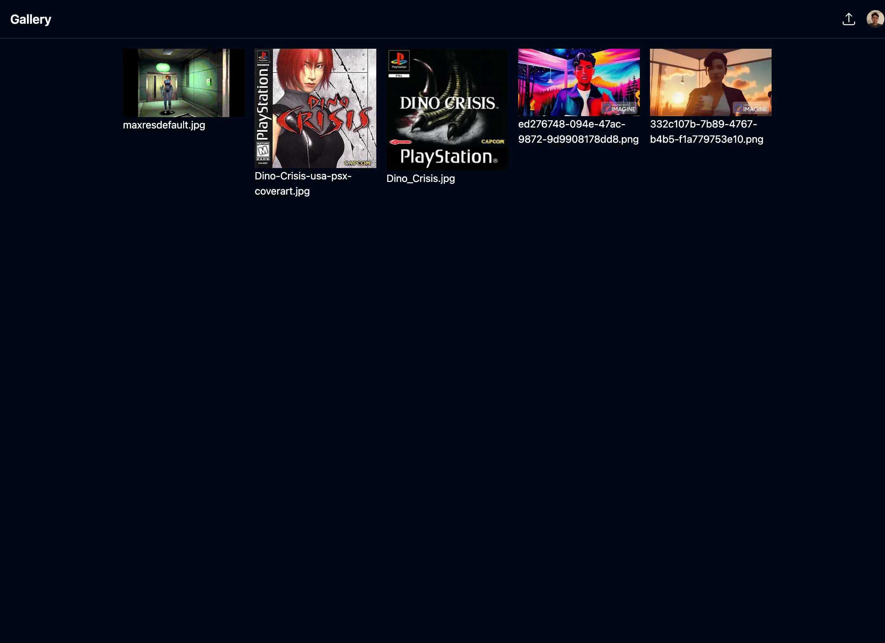
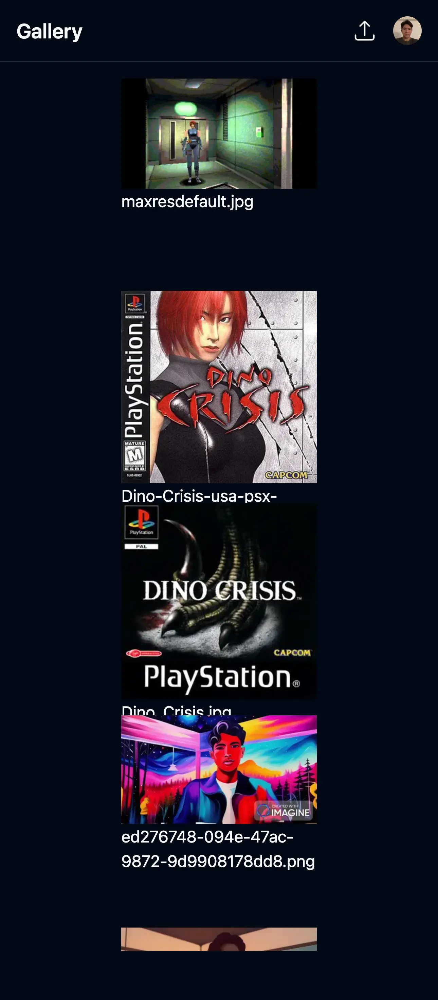

# T3 Gallery

This project is part of a tutorial of modern React by [Theo](https://x.com/theo) where we develop a gallery app using Next.js, Shadcn, Drizzle and launch it to production relaying some core functionalities on powerful services like:

- [Clerk](https://clerk.com/) which is a awesome service that handles all our authentication stuff.
- [Uploadthing](https://uploadthing.com/) is where we are going to upload our images, it has an increadible integration with Next.js.
- [Upstash](https://upstash.com/) our dababase service.
- [Sentry](https://sentry.io/welcome/) it help us with error management.
- [PostHog](https://posthog.com/) analytics.

## Screenshots

## TODO

- [x] Make it deploy (vercel)
- [x] Scaffold basic ui with mock data
- [x] Tidy up build process
- [x] Actually set up a database (vercel postgres)
- [x] Attach database to UI
- [x] Add authentication (w/ clerk)
- [x] Add image upload
- [x] "taint" (server-only)
- [x] Use Next/Image component
- [x] Error management (w/ Sentry)
- [x] Routing/image page (parallel route)
- [x] Update upload button to be less cringe
- [x] ShadUIify (specifically toasts)
- [x] Analytics (posthog)
- [x] Delete button (w/ Server Actions)
- [x] Ratelimiting (upstash)
